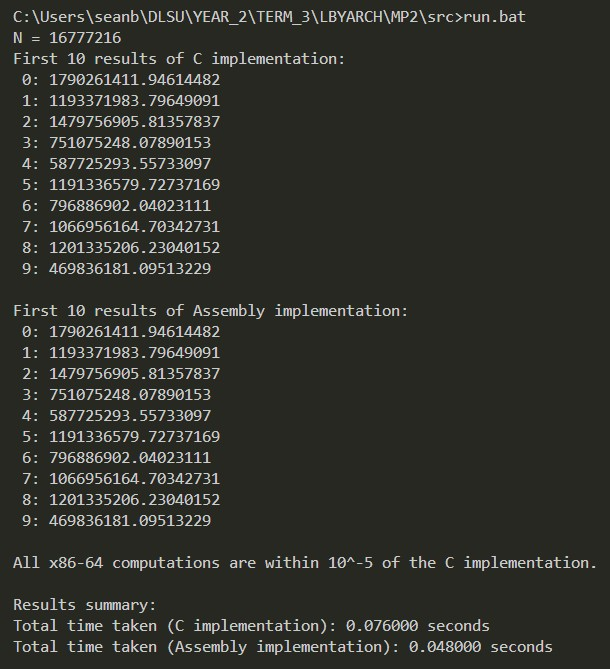

# LBYARCH MP2
## A comparative analysis between native C and assembly language implementations of the Euclidean distance algorithm.

## Written by
LBYARCH S14 Group 1:
- Sean Bernardo
- RC Faustino

=====

## 1 Comparative Analysis

The complete output of our program runs can be found in unit_tests.xlsx, which includes the results of both the C and assembly implementations of the Euclidean distance algorithm. The results are compared based on execution time and correctness.

The summary statistics for the C and assembly implementations are as follows:

Mean
| N    | C      | Asm    |
|------|--------|--------|
| 2^20 | 0.0042 | 0.0026 |
| 2^24 | 0.0662 | 0.0405 |
| 2^29 | 5.3828 | 5.1399 |

Median
| N    | C      | Asm    |
|------|--------|--------|
| 2^20 | 0.0040 | 0.0030 |
| 2^24 | 0.0660 | 0.0400 |
| 2^29 | 5.5400 | 4.9930 |

Standard Deviation

| N    | C      | Asm    |
|------|--------|--------|
| 2^20 | 0.0007 | 0.0006 |
| 2^24 | 0.0026 | 0.0019 |
| 2^29 | 1.4049 | 1.6061 |

## 2 Documentation

### 2.1 C Sample Run

### 2.2 Assembly Sample Run

